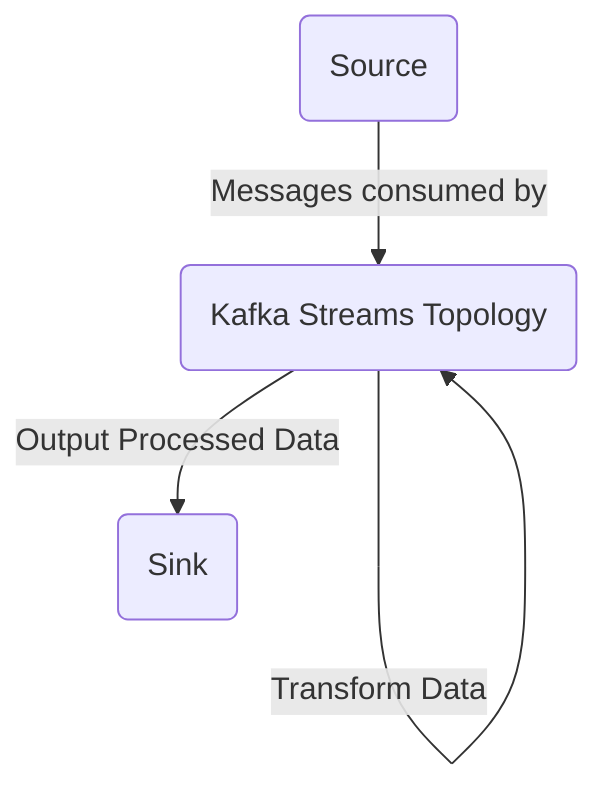

# kstreams-demo
A simple repository to play around with Kafka streams. Built with Kotlin, Ktor and Kafka Streams. 

### Architecture 
A simple demo application designed to showcase Kafka Streams' Topology to handle data flow. 
It receives messages from a source, undergoes the necessary transformations and subsequently outputs 
the processed data to a sink. 

Technologies
* Kafka Streams
* Kotlin
* Ktor
* Kotest
* Testcontainers
* Gradle

